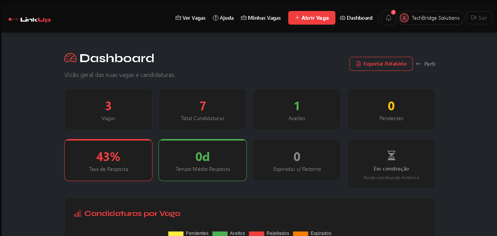
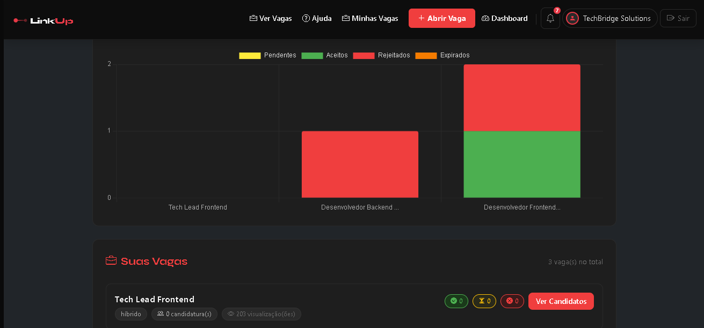
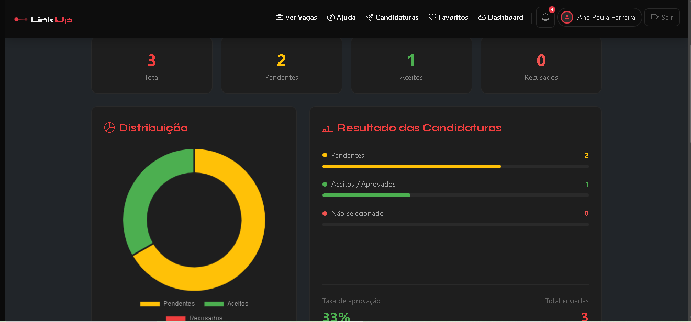
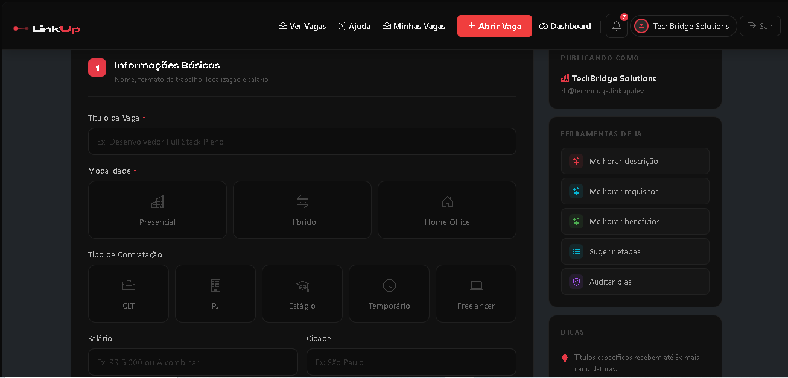
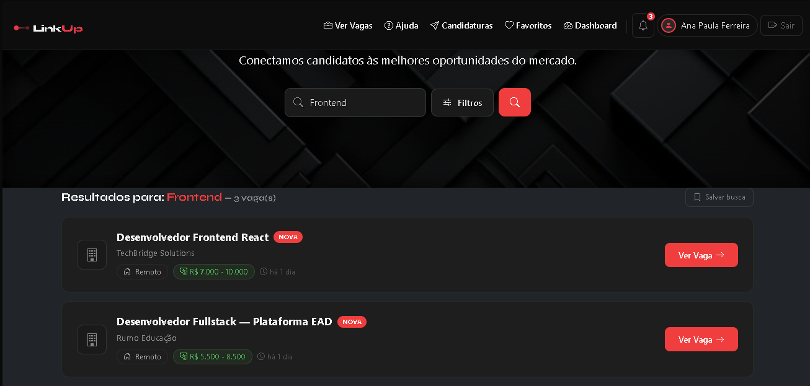
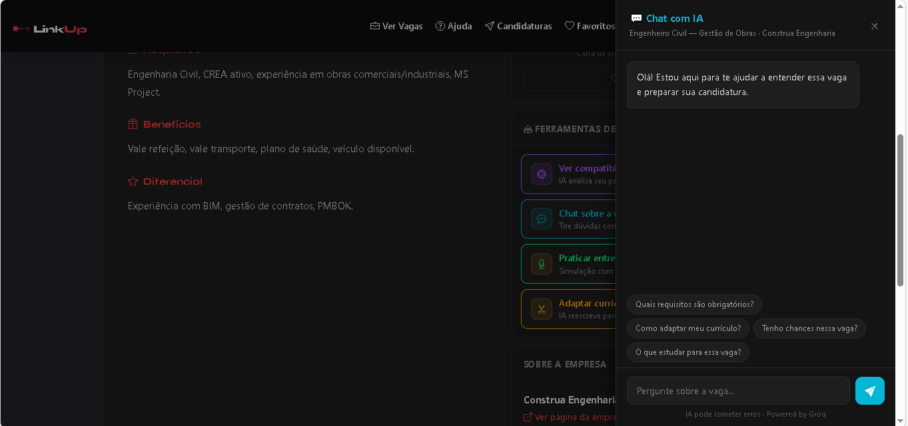
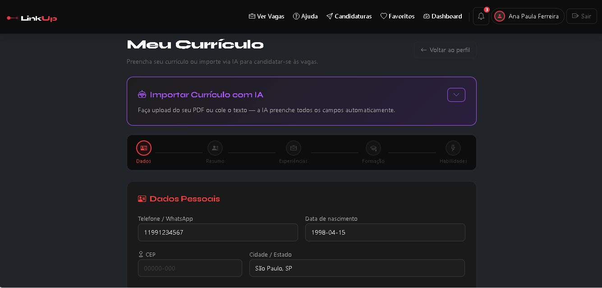
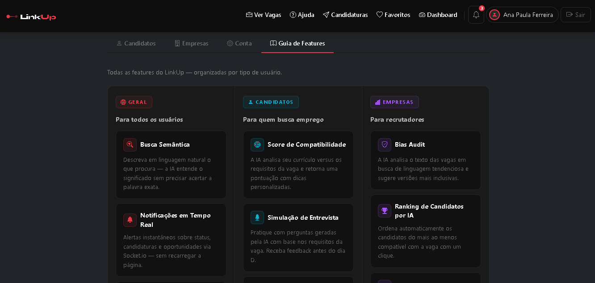
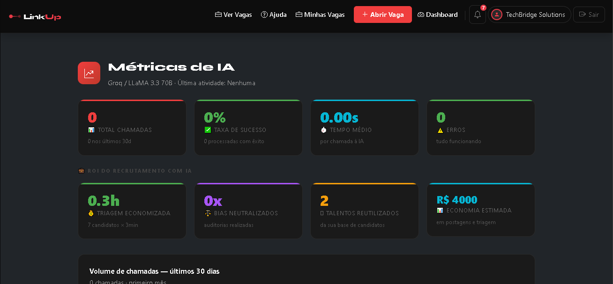

<div align="center">

# LinkUp — Plataforma de Recrutamento Inteligente

**Conectando talentos e empresas com precisão, contexto e inteligência artificial.**


</div>

---

## Visão Geral

O **LinkUp** é uma plataforma bilateral de recrutamento que coloca inteligência artificial no núcleo de cada interação. Candidatos encontram oportunidades com precisão semântica e recebem suporte ativo da IA para se posicionarem melhor no mercado. Empresas gerenciam processos seletivos completos, desde a publicação da vaga até o onboarding, com ferramentas de auditoria, ranqueamento e redescoberta de talentos.

O projeto foi desenvolvido como Trabalho de Conclusão de Curso (TCC) em Engenharia de Software, com foco em arquitetura em camadas, segurança aplicada e experiência de usuário realista para ambos os perfis da plataforma.

---

## Funcionalidades

### Para Candidatos

| Funcionalidade                   | Descrição                                                                                                                                 |
| -------------------------------- | ----------------------------------------------------------------------------------------------------------------------------------------- |
| **Busca Semântica Híbrida**      | Combina embeddings semânticos (`sentence-transformers`) com BM25 keyword-matching via Reciprocal Rank Fusion — captura intenção e termos exatos simultaneamente |
| **Score de Compatibilidade**     | IA analisa currículo vs. descrição da vaga e gera uma pontuação fundamentada                                                              |
| **Carta de Apresentação por IA** | Geração automática e contextualizada a partir do perfil e da vaga                                                                         |
| **Tailoring de Currículo**       | Sugestões de adaptação do currículo para uma vaga específica                                                                              |
| **Chat Contextual com IA**       | Conversa interativa sobre qualquer vaga aberta                                                                                            |
| **Simulação de Entrevista**      | Perguntas geradas pela IA com base na descrição da vaga; avaliação das respostas ao final                                                 |
| **Importação de Currículo PDF**  | Extração automática de texto com parsing ATS e badges de habilidades detectadas                                                           |
| **Melhoria de Currículo por IA** | Análise e reescrita profissional do currículo                                                                                             |
| **Favoritos e Alertas**          | Salvar buscas com alertas automáticos por e-mail quando novas vagas compatíveis surgem                                                    |
| **Rastreamento de Candidaturas** | Acompanhe cada etapa do processo seletivo em tempo real                                                                                   |
| **Oportunidades Revisitadas**    | A plataforma sugere proativamente candidaturas anteriores com vagas similares abertas                                                     |
| **Status de Disponibilidade**    | Informe ao mercado se está aberto a oportunidades                                                                                         |

### Para Empresas

| Funcionalidade                      | Descrição                                                                                                                              |
| ----------------------------------- | -------------------------------------------------------------------------------------------------------------------------------------- |
| **Pipeline de Etapas Configurável** | Defina etapas customizadas do processo seletivo (ex: Triagem, Entrevista Técnica, Proposta); IA sugere etapas com base na área da vaga |
| **Ranking de Candidatos**           | IA ordena candidatos por compatibilidade com a vaga, com justificativa                                                                 |
| **Candidatos Similares**            | Recomendação de perfis similares ao melhor candidato de uma vaga                                                                       |
| **Redescoberta de Talentos**        | Identifica candidatos de processos anteriores que se encaixam em vagas abertas agora                                                   |
| **Vagas PCD**                       | Empresa pode marcar a vaga como exclusiva ou prioritária para Pessoas com Deficiência; badge visual destacado na listagem e na página da vaga |
| **Bias Auditor**                    | Analisa a descrição da vaga em busca de linguagem excludente ou tendenciosa                                                            |
| **Melhoria de Descrição por IA**    | Reescreve e aprimora a descrição da vaga                                                                                               |
| **Encerramento Estruturado**        | Ao encerrar uma vaga, notifica candidatos com feedback humanizado por IA                                                               |
| **Dashboard de Métricas**           | Visualizações de conversão por etapa, tempo médio por fase e performance do pipeline                                                   |
| **Exportação de Relatórios em PDF** | Dashboard e candidaturas exportáveis                                                                                                   |
| **Onboarding com Checklist**        | Guia passo a passo para novos usuários completarem seu perfil e extraírem valor máximo da plataforma                                   |
| **Notificações em Tempo Real**      | Socket.io para feedback imediato de eventos relevantes                                                                                 |
| **Métricas de IA**                  | Log completo de uso das features de IA, com volumes, features mais usadas e modelos acionados                                          |

---

## Stack Tecnológica

```
Backend          Node.js 22 + Express 4
ORM              Sequelize 6 (PostgreSQL 16)
View Layer       Express-Handlebars + Bootstrap 5 (tema dark)
IA Principal     Groq SDK — modelo LLaMA 3.3 70B (via API)
Busca Semântica  Python 3 + Flask + sentence-transformers (microserviço, porta 5001)
Tempo Real       Socket.io 4
Jobs Agendados   node-cron 4
Segurança        Helmet, csrf-csrf, express-rate-limit, bcryptjs
Upload           Multer (memória) + pdfjs-dist (parsing)
PDF              html-pdf-node
E-mail           Nodemailer (Gmail)
```

---

## Arquitetura Resumida

```
┌──────────────────────────────────────────────────────────┐
│                     Cliente (Browser)                    │
│            Bootstrap 5 Dark + Handlebars + Socket.io     │
└────────────────────────┬─────────────────────────────────┘
                         │ HTTP / WebSocket
┌────────────────────────▼─────────────────────────────────┐
│                   Camada de Rotas                         │
│     routes/ → middleware (auth, CSRF, rate limit)        │
└────────────────────────┬─────────────────────────────────┘
                         │
┌────────────────────────▼─────────────────────────────────┐
│                  Camada de Controllers                    │
│         Orquestração de requisição e resposta            │
└──────────┬──────────────────────────┬────────────────────┘
           │                          │
┌──────────▼──────────┐   ┌───────────▼──────────────────┐
│  Camada de Services │   │     Camada de Helpers        │
│  Lógica de negócio  │   │  aiService, pdfService,      │
│  applicationService │   │  jobSearch, mailer, socket   │
│  talentRediscovery  │   └───────────────────────────────┘
│  similarCandidates  │
└──────────┬──────────┘
           │
┌──────────▼──────────────────────────────────────────────┐
│                     Modelos (Sequelize)                  │
│         User, Job, Application, Resume, AiLog...        │
└──────────┬──────────────────────────────────────────────┘
           │
┌──────────▼──────────┐   ┌──────────────────────────────┐
│    PostgreSQL DB    │   │  Microserviço Python (5001)  │
│     linkup_db       │   │  Flask + sentence-transformers│
└─────────────────────┘   └──────────────────────────────┘
```

> Para detalhes completos da arquitetura, ADRs e diagramas Mermaid, consulte [`docs/architecture.md`](docs/architecture.md).

---

## Como Executar Localmente

### Pré-requisitos

- Node.js 18+ e npm
- PostgreSQL 14+
- Python 3.9+ com pip
- Conta Groq com chave de API (gratuita em [console.groq.com](https://console.groq.com))
- Conta Gmail com App Password habilitada (para envio de e-mails)

### 1. Clonar o repositório

```bash
git clone https://github.com/seu-usuario/linkup.git
cd linkup
```

### 2. Instalar dependências Node.js

```bash
npm install
```

### 3. Configurar variáveis de ambiente

```bash
cp .env.example .env
```

Edite o arquivo `.env` com seus valores:

```env
# Banco de Dados
DB_HOST=localhost
DB_PORT=5432
DB_NAME=linkup_db
DB_USER=postgres
DB_PASS=sua_senha_postgres

# Sessão (gere um valor aleatório longo)
SESSION_SECRET=chave_secreta_longa_e_aleatoria

# IA — Groq
GROQ_API_KEY=gsk_...sua_chave...

# E-mail — Gmail App Password
GMAIL_USER=seu_email@gmail.com
GMAIL_PASS=sua_app_password_16_digitos

# Ambiente
NODE_ENV=development
PORT=3000

# Validação de empresa (opcional — habilita verificação de CNPJ/domínio)
VALIDATE_COMPANY=false
```

### 4. Criar banco de dados

```bash
# No psql ou pgAdmin, crie o banco:
createdb linkup_db

# Ou via psql:
psql -U postgres -c "CREATE DATABASE linkup_db;"
```

### 5. Executar migrações

```bash
npm run migrate
```

### 6. (Opcional) Popular banco com dados de exemplo

```bash
npm run seed
```

### 7. Configurar e iniciar o microserviço Python

```bash
cd python-search
python -m venv venv

# Linux/macOS:
source venv/bin/activate
# Windows:
venv\Scripts\activate

pip install -r requirements.txt
python app.py
# Rodando em http://localhost:5001
```

### 8. Iniciar a aplicação principal

```bash
# Desenvolvimento (com hot-reload):
npm run dev

# Produção:
npm start
```

Acesse: **http://localhost:3000**

---

## Screenshots

### Landing Page


### Dashboard da Empresa



### Dashboard do Candidato


### Criar / Abrir Vaga


### Busca Semântica Híbrida


### Chat com IA


### Currículo


### Guia de Features


### Métricas de IA


---

## Estrutura de Diretórios

```
linkup/
├── server.js                  # Entry point — inicializa HTTP + Socket.io
├── app.js                     # Configuração Express (middlewares, rotas, erros)
├── seed.js                    # Dados de exemplo para desenvolvimento
├── src/
│   ├── config/                # Banco, sessão, Passport, Handlebars, Socket.io
│   ├── controllers/           # Lógica de apresentação (thin controllers)
│   ├── helpers/               # Serviços utilitários (IA, PDF, e-mail, busca)
│   ├── jobs/                  # Cron jobs (alertas, expiração, cleanup)
│   ├── middleware/             # Auth, CSRF, rate limit, validação, audit log
│   ├── models/                # Entidades Sequelize + relacionamentos
│   ├── routes/                # Definição de endpoints HTTP
│   ├── services/              # Lógica de negócio desacoplada
│   └── utils/                 # Utilitários transversais (cache de IA)
├── views/                     # Templates Handlebars
│   ├── layouts/
│   └── partials/
├── public/                    # Ativos estáticos (CSS, imagens)
├── python-search/             # Microserviço Flask (busca semântica)
├── migrations/                # Histórico de schema do banco
└── docs/                      # Documentação técnica
    ├── architecture.md
    └── business-rules.md
```

---

## Documentação Técnica

| Documento                                          | Conteúdo                                                            |
| -------------------------------------------------- | ------------------------------------------------------------------- |
| [`docs/architecture.md`](docs/architecture.md)     | Arquitetura em camadas, diagramas Mermaid, ADRs e decisões técnicas |
| [`docs/business-rules.md`](docs/business-rules.md) | Regras de negócio numeradas por módulo (RN-001...)                  |

---

## Segurança

O projeto passou por auditoria de segurança completa, incluindo:

- Proteção CSRF com `csrf-csrf` (stateless double-submit)
- Rate limiting por endpoint sensível (login, registro, IA, upload)
- Sanitização global de inputs (`sanitizeInputs` middleware)
- Headers de segurança via Helmet com CSP restritiva
- Cookies com `httpOnly`, `sameSite: strict` e `secure` em produção
- Prevenção de enumeração de usuários nas rotas de autenticação
- XSS prevention com `escHtml()` nos templates de PDF
- `userId` via sessão no Socket.io (sem exposição em cliente)
- 0 vulnerabilidades críticas reportadas pelo `npm audit`

---

## Licença

Distribuído sob a licença **MIT**. Consulte o arquivo `LICENSE` para detalhes.

---

<div align="center">

Desenvolvido por **Thiago Henrique Queiroz Muniz Silva** — TCC em Engenharia de Software · 2026

</div>
