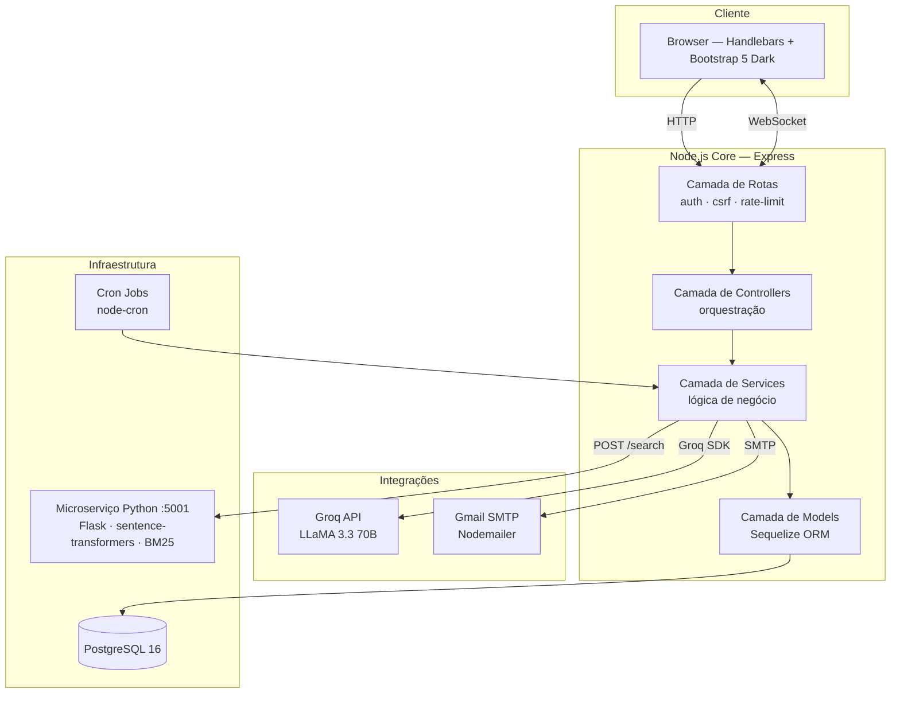
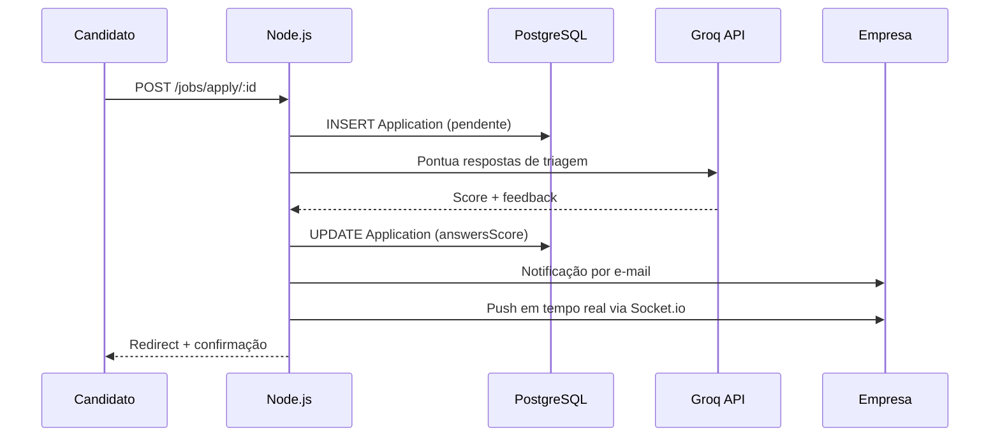
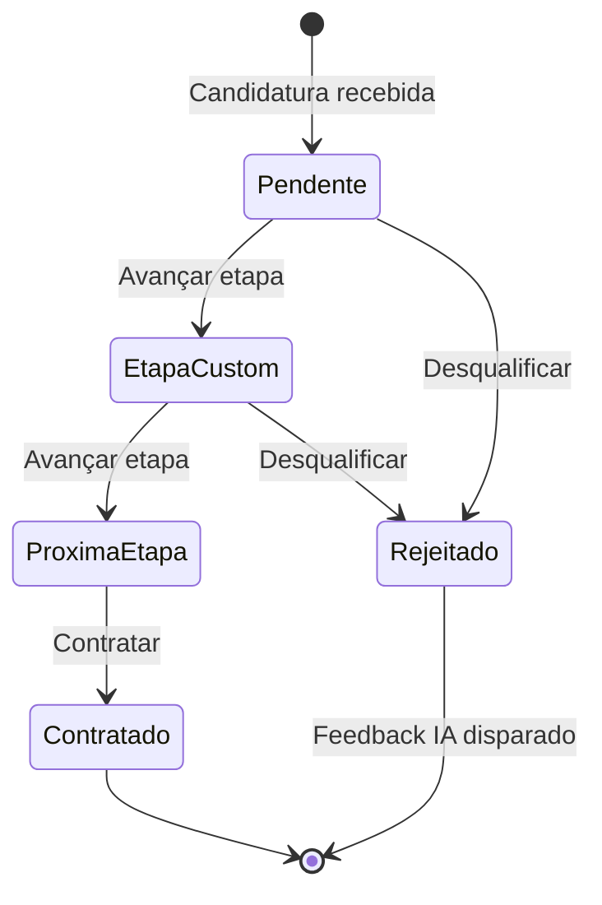
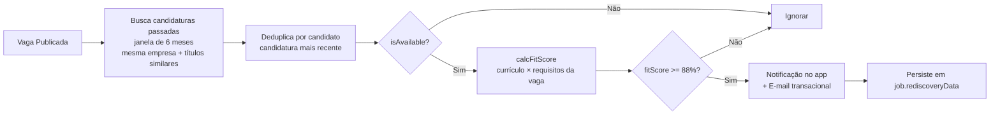

<div align="center">

# LinkUp

**Infraestrutura inteligente de recrutamento para o mercado brasileiro.**

[](https://nodejs.org)
[](https://expressjs.com)
[](https://postgresql.org)
[](https://socket.io)
[](https://groq.com)
[](https://python.org)
[](LICENSE)

</div>

---

## Visão Geral

O LinkUp é uma plataforma bilateral de recrutamento que coloca inteligência artificial no núcleo de cada interação. Candidatos encontram oportunidades com precisão semântica e recebem suporte ativo da IA para se posicionarem melhor no mercado. Empresas gerenciam processos seletivos completos — desde a publicação da vaga até a contratação — com ferramentas de ranqueamento, auditoria e redescoberta de talentos integradas nativamente.

**O problema que resolve:** o mercado de tech brasileiro tem um problema estrutural de correspondência — candidatos qualificados são filtrados por sistemas baseados em keywords, enquanto empresas desperdiçam horas de recrutamento em triagem inicial. O LinkUp ataca os dois lados simultaneamente com uma única plataforma inteligente.

**Quem usa:**
- **Candidatos** — busca semântica, tailoring de currículo por IA, simulação de entrevista, acompanhamento em tempo real do pipeline
- **Empresas** — pipeline de contratação customizável, ranqueamento de candidatos por IA, feedback automatizado e humanizado, redescoberta proativa de talentos

---

## Visão do Produto

O LinkUp é posicionado como **infraestrutura de recrutamento**, não como quadro de vagas.

| Quadro de Vagas | LinkUp |
|---|---|
| Listagem passiva | Matching inteligente ativo |
| Candidatos se filtram sozinhos | Score de fit mútuo por vaga |
| Pipeline manual | Pipeline por etapas com ranqueamento IA |
| Sem ciclo de feedback | Feedback humanizado automatizado |
| Publicar e esperar | Redescoberta proativa da base de talentos |

A visão de longo prazo é se tornar a camada de dados do recrutamento tech brasileiro — onde cada candidatura gera sinal que melhora os matches futuros em toda a plataforma.

---

## Funcionalidades Principais

### Busca Semântica Híbrida
Combina um microserviço Python (sentence-transformers + BM25 + Reciprocal Rank Fusion) com filtragem SQL. Captura tanto a intenção semântica quanto os termos exatos simultaneamente. Empresas bloqueadas pelo candidato são automaticamente excluídas dos resultados. Fallback gracioso para SQL caso o serviço Python esteja indisponível.

### Redescoberta de Talentos
Quando uma vaga é publicada, a plataforma escaneia automaticamente a base histórica de candidatos da empresa (janela de 6 meses) e exibe candidatos com fit ≥ 88% que estão disponíveis no momento. Dispara notificações no app e e-mails transacionais. Elimina o custo de reanúncio de posições que a base existente já cobre.

### Pipeline de Contratação com Gestão de Etapas
Empresas definem etapas customizadas por vaga (ex: Triagem → Entrevista Técnica → Proposta). Cada transição é registrada com timestamp. Quando a vaga é encerrada, o sistema gera feedback escrito por IA, personalizado por candidato, para todos os não contratados — reduzindo abandono e protegendo a marca empregadora.

### Suite de Features de IA (Groq / LLaMA 3.3 70B)
Nove features distintas alimentadas por IA, cada uma medida e registrada:

| Feature | Perfil | Descrição |
|---|---|---|
| Gerador de Carta de Apresentação | Candidato | Carta personalizada para a vaga específica |
| Tailoring de Currículo | Candidato | Adapta o currículo aos requisitos da vaga |
| Score de Compatibilidade | Candidato | Explica lacunas de fit antes de candidatar |
| Simulação de Entrevista | Candidato | Perguntas por vaga com avaliação por IA |
| Ranqueamento de Candidatos | Empresa | Ranking por compatibilidade com justificativa |
| Comparação de Candidatos | Empresa | Análise IA lado a lado de 2 a 3 candidatos |
| Bias Auditor | Empresa | Detecta linguagem excludente na descrição da vaga |
| Chat Contextual | Ambos | IA conversacional vinculada a uma vaga específica |
| Melhoria de Vaga | Empresa | Sugestões para melhorar a qualidade e alcance da publicação |

### Dashboard de Métricas de IA
Observabilidade em tempo real do consumo de IA: volume de chamadas, taxas de sucesso, latência média por feature, gráfico de tendência 30 dias e monitoramento de capacidade da API com indicadores visuais de status e alertas proativos a 80% do limite diário.

### Dashboards por Perfil
- **Candidato**: funil de candidaturas, taxa de resposta, horas estimadas economizadas pela IA, mapeamento de preferência de modalidade
- **Empresa**: conversão do pipeline por etapa, tempo médio de contratação, uso do Bias Auditor, economia estimada em triagem, métricas de reaproveitamento de talentos

---

## Arquitetura do Sistema

O LinkUp é um monólito estruturado com um microserviço Python desacoplado para busca semântica. A arquitetura prioriza simplicidade operacional na escala atual, mantendo fronteiras de camada claras que permitem extração futura de serviços.



### Fluxo de Candidatura



### Fluxo do Pipeline de Etapas



### Fluxo de Redescoberta de Talentos



> Documentação técnica completa, ADRs e diagramas de fluxo de dados: [`docs/architecture.md`](docs/architecture.md)

---

## Decisões Técnicas

### Monólito Estruturado
Na escala atual, microsserviços introduziriam overhead operacional — service discovery, rastreamento distribuído, latência de rede — sem benefício real. O código aplica separação estrita de camadas (`routes → controllers → services → models`) com dependências unidirecionais. Extrair um serviço para seu próprio processo requer mudar apenas a camada de transporte, não a lógica de negócio.

O microserviço Python é a exceção deliberada: roda workloads de ML (inferência de sentence-transformers) que seriam operacionalmente inconvenientes dentro de um processo Node.js. Essa fronteira é funcional, não organizacional.

### PostgreSQL como Store Principal
Escolhido pelas garantias ACID em dados relacionais (candidaturas, transições de pipeline, contas) combinadas com suporte nativo a colunas JSON para dados semi-estruturados (arrays de habilidades do currículo, histórico de etapas, respostas de triagem). O histórico de 30 migrações reflete evolução iterativa de schema gerenciada via Sequelize CLI.

### Groq / LLaMA 3.3 70B
Latência de inferência abaixo de 1 segundo — crítica para features interativas como entrevista simulada e chat. A restrição do plano gratuito (30 RPM, 1.000 req/dia) é monitorada em tempo real via Dashboard de Métricas de IA. Trocar de provedor requer mudar apenas `src/helpers/groq.js`.

### Reciprocal Rank Fusion para Busca
O microserviço combina similaridade semântica (distância cosseno em embeddings multilíngues) com relevância de keywords BM25 via RRF. BM25 puro perde matches semânticos; semântico puro retorna resultados topicamente similares mas irrelevantes. RRF funde listas ranqueadas sem exigir normalização de scores.

Veja [`docs/architecture.md`](docs/architecture.md) e [`docs/engineering-principles.md`](docs/engineering-principles.md) para o racional completo das decisões.

---

## Estratégia de Segurança

| Camada | Mecanismo |
|---|---|
| Transporte | Helmet.js — CSP, HSTS, X-Frame-Options, X-Content-Type-Options |
| Autenticação | Passport.js local strategy; bcryptjs (10 salt rounds); baseado em sessão |
| Sessões | `SESSION_SECRET` aleatório criptograficamente; TTL 24h; cookies `httpOnly` + `sameSite: strict` |
| CSRF | `csrf-csrf` double-submit cookie; token injetado em todo formulário via middleware `globalLocals` |
| Entradas | Sanitização `express-validator`; remoção global de HTML via middleware `sanitizeInputs` |
| Rate Limiting | Por endpoint: 10 logins/15min, 5 registros/hora, 10 chamadas IA/min, 3 uploads/min |
| Validação de Empresa | Verificação de CNPJ + enforçamento de domínio de e-mail corporativo (`VALIDATE_COMPANY=true`) |
| Segurança em PDF | `pdfUtils.escHtml()` sanitiza todo conteúdo do usuário antes da geração de PDF |
| Auditoria | Log JSON estruturado em todas as mutações sensíveis |
| Autorização | Guards por rota em todos os endpoints protegidos; verificação de ownership na camada de service |

---

## Considerações de Escalabilidade

**Restrições atuais:** processo Node.js único; PostgreSQL no mesmo host; microserviço Python como processo separado; Socket.io in-process.

**Principal gargalo — plano gratuito Groq:** 30 RPM / 1.000 req/dia. Mitigado por `src/utils/aiCache.js` com cache em memória para prompts determinísticos (mesma entrada = resposta em cache, zero chamada de API).

**Caminho para escalonamento horizontal:**

| Componente | Atual | Caminho de escala |
|---|---|---|
| Sessões | Memória in-process | Redis adapter (`connect-redis`) |
| Socket.io | In-process | `@socket.io/redis-adapter` |
| Cron jobs | `node-cron` in-process | Processo worker Bull/BullMQ |
| Cache de IA | `node-cache` (instância única) | Cache Redis compartilhado |
| Microserviço de busca | Processo Flask único | Workers Python com load balancer |
| Embeddings | Microserviço Python | pgvector (eliminar hop de rede) |

---

## Modelo de Negócio

**Mercado-alvo:** empresas de tech brasileiras (50–500 funcionários) gastando R$3.000–15.000/mês em recrutamento com baixas taxas de conversão.

**Estrutura:**
- **Candidatos** — gratuito permanente. Menor custo de aquisição; base maior de candidatos aumenta o valor da plataforma para empresas
- **Empresas** — freemium com camada de IA baseada em uso:

| Plano | Preço | Inclui |
|---|---|---|
| Gratuito | R$0 | 3 vagas ativas, pipeline básico |
| Growth | R$299/mês | Vagas ilimitadas, suite de IA completa, redescoberta de talentos |
| Scale | R$799/mês | Multi-recrutador, acesso à API, integrações ATS, SLA |

As features de IA são a alavanca principal de monetização — cada chamada de IA no plano gratuito demonstra valor que converte para pago. O modelo `AiLog` captura esse sinal com precisão.

**Expansão:** gestão de pipeline white-label para agências de recrutamento; dados anônimos do mercado de contratações como produto B2B.

---

## Roadmap

### v1.0 — Entregue
- [x] Autenticação dual com verificação de e-mail
- [x] CRUD de vagas — modalidade, tipo de contrato, flag PCD
- [x] Busca semântica híbrida (microserviço Python, ranking RRF)
- [x] Pipeline de contratação customizável com transições de etapa
- [x] IA: carta de apresentação, tailoring de currículo, score de compatibilidade
- [x] IA: simulação de entrevista com avaliação
- [x] IA: ranqueamento e comparação de candidatos
- [x] IA: Bias Auditor para descrições de vaga
- [x] IA: chat contextual por vaga
- [x] Redescoberta de talentos (automatizada + cron agendado)
- [x] Candidatos similares (painel sugerido + por candidatura)
- [x] Feedback de rejeição automatizado por IA ao encerrar vaga
- [x] Notificações em tempo real via Socket.io
- [x] Dashboards por perfil com exportação em PDF
- [x] Dashboard de Métricas de IA com monitoramento de capacidade Groq
- [x] Buscas salvas com alertas semanais por e-mail
- [x] Score de responsividade da empresa
- [x] Gestão de status de disponibilidade do candidato
- [x] Checklists de onboarding por perfil
- [x] Rate limiting, CSRF, Helmet CSP, audit logging
- [x] 4 cron jobs: alertas, expiração, limpeza, redescoberta

### v1.1 — Planejado
- [ ] Redis session store + Socket.io adapter para implantação multi-instância
- [ ] Fila Bull para jobs de IA (desacoplar do ciclo de requisição)
- [ ] Integração pgvector (eliminar dependência do microserviço Python)
- [ ] Suporte a webhooks para integrações ATS
- [ ] Contas de empresa multi-recrutador

### v2.0 — Planejado
- [ ] PWA mobile-first
- [ ] API pública com chaves com rate limit
- [ ] Analytics anônimos do mercado de contratações (produto de dados B2B)
- [ ] Ranqueamento baseado em ML (substituir ranqueamento LLM por modelo fine-tuned)

---

## Screenshots

### Landing Page


### Dashboard da Empresa


### Dashboard do Candidato


### Criar / Abrir Vaga


### Busca Semântica Híbrida


### Chat com IA


### Currículo


### Guia de Features


### Métricas de IA


---

## Estrutura do Projeto

```
linkup/
├── server.js                  # Entry point — servidor HTTP + inicialização Socket.io
├── app.js                     # Configuração Express — middleware, rotas, tratamento de erros
├── seed.js                    # Dados de exemplo para desenvolvimento
├── src/
│   ├── config/                # Banco de dados, sessão, Passport, Handlebars, Socket.io
│   ├── controllers/           # Orquestração de requisições (camada thin)
│   ├── helpers/               # Serviços utilitários — IA, PDF, e-mail, busca, logging
│   ├── jobs/                  # Cron jobs — alertas, expiração, limpeza, redescoberta
│   ├── middleware/            # Guards de auth, CSRF, rate limiting, validação, auditoria
│   ├── models/                # Entidades Sequelize + associações
│   ├── routes/                # Definições de endpoints HTTP
│   ├── services/              # Lógica de negócio — desacoplada da camada HTTP
│   └── utils/                 # Utilitários transversais (cache de respostas IA)
├── views/                     # Templates Handlebars
│   ├── layouts/
│   └── partials/
├── public/                    # Assets estáticos
├── python-search/             # Microserviço de busca semântica (Flask)
├── migrations/                # Histórico de migrações do schema PostgreSQL (30 arquivos)
└── docs/                      # Documentação técnica
```

---

## Primeiros Passos

Veja [docs/deployment.md](docs/deployment.md) para o guia completo de configuração.

```bash
# Clonar e instalar
git clone <repo> && cd linkup
npm install

# Configurar ambiente
cp .env.example .env   # preencher variáveis obrigatórias

# Banco de dados
npx sequelize-cli db:migrate
node seed.js           # opcional: popular com dados de teste

# Iniciar microserviço Python (terminal separado)
cd python-search && pip install -r requirements.txt && python app.py

# Iniciar aplicação
npm run dev            # desenvolvimento
npm start              # produção
```

---

## Documentação Técnica

| Documento | Descrição |
|---|---|
| [docs/api.md](docs/api.md) | Referência da API REST — endpoints, payloads, status HTTP |
| [docs/architecture.md](docs/architecture.md) | Arquitetura do sistema, fluxos de dados, ADRs |
| [docs/engineering-principles.md](docs/engineering-principles.md) | Padrões de engenharia e princípios de design |
| [docs/deployment.md](docs/deployment.md) | Configuração de ambiente e deploy em produção |

---

## Licença

MIT — veja [LICENSE](LICENSE).

---

<div align="center">

Desenvolvido por **Thiago Henrique Queiroz Muniz Silva**

</div>
