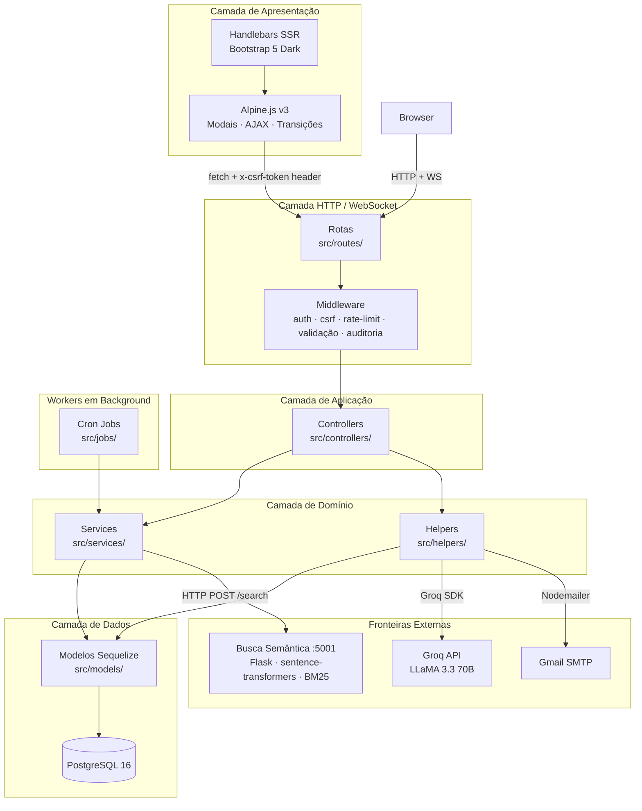
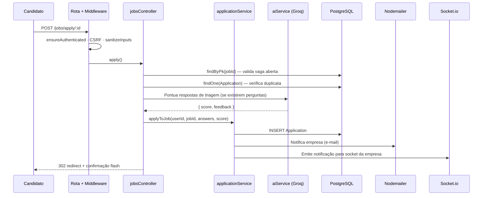
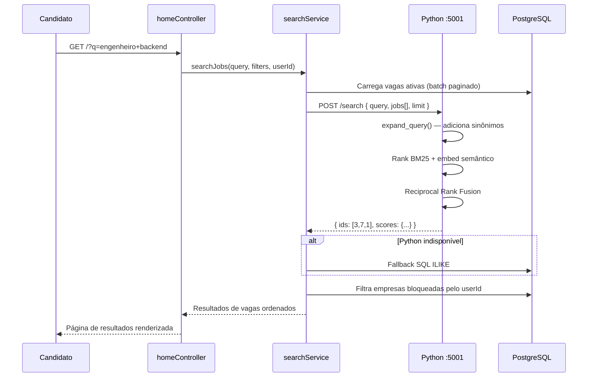
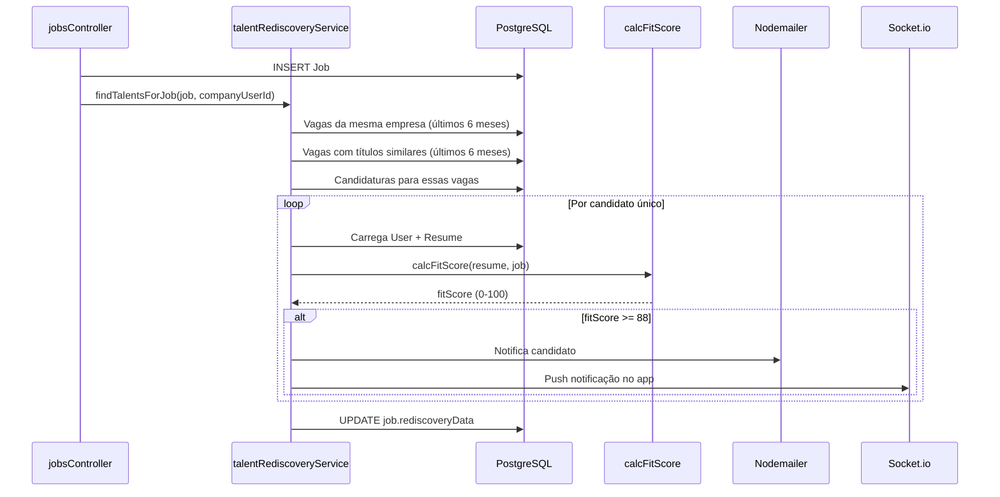
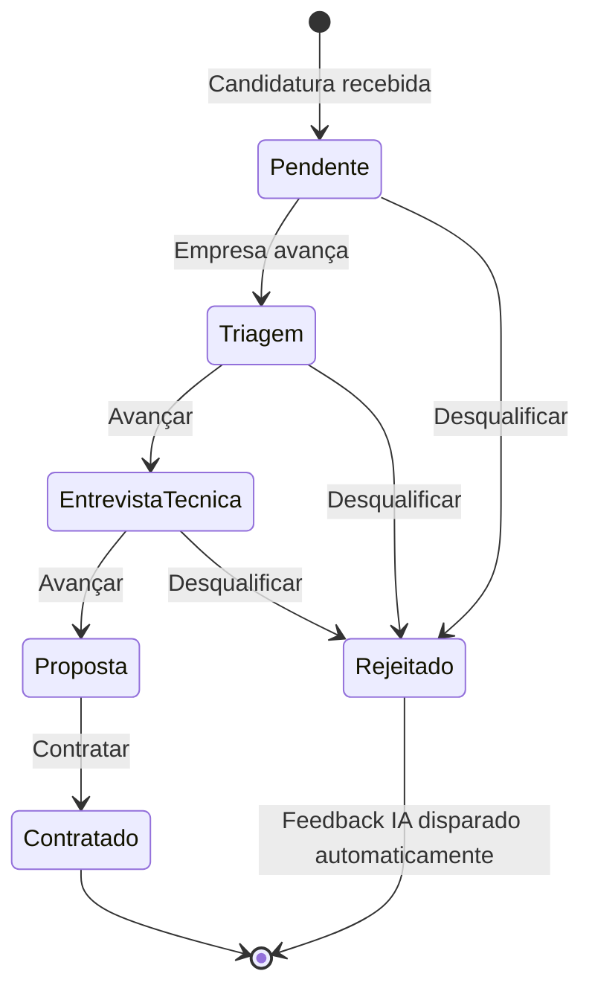

# Arquitetura do Sistema — LinkUp

---

## Sumário

1. [Visão Geral](#1-visão-geral)
2. [Diagrama de Camadas](#2-diagrama-de-camadas)
3. [Responsabilidades por Camada](#3-responsabilidades-por-camada)
4. [Fluxos de Dados](#4-fluxos-de-dados)
5. [Microserviço Python — Busca Semântica](#5-microserviço-python--busca-semântica)
6. [Comunicação em Tempo Real](#6-comunicação-em-tempo-real)
7. [Jobs em Background](#7-jobs-em-background)
8. [Diagrama de Entidades](#8-diagrama-de-entidades)
9. [Integrações Externas](#9-integrações-externas)
10. [Decisões Arquiteturais (ADRs)](#10-decisões-arquiteturais-adrs) — ADR-001 a ADR-010
11. [Limitações Conhecidas e Caminho de Escala](#11-limitações-conhecidas-e-caminho-de-escala)

---

## 1. Visão Geral

O LinkUp é um **monólito estruturado** com um microserviço Python desacoplado para busca semântica. O núcleo é uma aplicação Node.js/Express server-rendered organizada em camadas rígidas. O serviço Python executa inferência de ML — workload que seria operacionalmente inconveniente dentro de um processo Node.js.

A escolha por MPA (Multi-Page Application) server-side rendering foi deliberada: reduz complexidade de estado no cliente, garante que conteúdo gerado por IA seja sanitizado e renderizado com segurança no servidor, e simplifica a proteção CSRF. Socket.io cobre os casos de uso que precisam de reatividade em tempo real.

| Componente | Tecnologia | Responsabilidade |
|---|---|---|
| Servidor Web | Node.js 20 + Express 4 | Roteamento, middleware, SSR |
| Banco de Dados | PostgreSQL 16 + Sequelize 6 | Persistência e relacionamentos |
| IA Principal | Groq API — LLaMA 3.3 70B | Todas as features de linguagem natural |
| Busca Semântica | Python Flask + sentence-transformers | Embeddings, BM25, Reciprocal Rank Fusion |
| Tempo Real | Socket.io 4 | Notificações push sem polling |
| Jobs Agendados | node-cron 4 | Alertas, expiração, cleanup, redescoberta |
| E-mail | Nodemailer + Gmail SMTP | Verificação, recuperação, alertas, feedback |
| Interatividade Frontend | Alpine.js v3 | Modais, transições e chamadas AJAX leves sem SPA |

---

## 2. Diagrama de Camadas



---

## 3. Responsabilidades por Camada

### Camada de Rotas (`src/routes/`)
Plumbing HTTP puro. Monta cadeias de middleware, mapeia verbos HTTP para métodos de controller e aplica guards de autenticação. Não contém lógica de negócio.

```
routes/index.js      — Monta todos os sub-roteadores; aplica aiLimiter global nas rotas de IA
routes/auth.js       — Endpoints de autenticação
routes/jobs.js       — Vagas e candidaturas
routes/aiMetrics.js  — Dashboard de uso de IA
routes/chat.js       — Chat contextual por vaga
routes/profile.js    — Perfil e dashboard
routes/resume.js     — Currículo
routes/interview.js  — Simulação de entrevista
routes/biasAudit.js  — Auditoria de viés
routes/tailoring.js  — Tailoring de currículo
routes/savedSearches.js  — Buscas salvas
routes/notifications.js  — Notificações
```

### Camada de Middleware (`src/middleware/`)
Preocupações transversais aplicadas antes de qualquer controller.

| Middleware | Responsabilidade |
|---|---|
| `auth.js` | Guards baseados em sessão: `ensureAuthenticated`, `ensureCompany`, `ensureGuest` |
| `globalLocals.js` | Injeta `csrfToken`, objeto `user`, mensagens flash e contagem de notificações não lidas em toda resposta |
| `Ratelimiter.js` | Rate limits por endpoint: login, registro, IA, upload, reset de senha |
| `Validation.js` | Sanitização de entrada e validação de campos via `express-validator` |
| `validateCompany.js` | Verificação de CNPJ + enforçamento de domínio de e-mail corporativo |
| `auditLog.js` | Trilha de auditoria JSON estruturado em mutações sensíveis |

### Camada de Controllers (`src/controllers/`)
Orquestra o ciclo requisição-resposta. Chama services e helpers, agrega resultados e renderiza templates ou retorna JSON. Controllers não contêm lógica de negócio — eles a coordenam.

Padrão de método de controller:
```
1. Extrair e validar entrada do req
2. Chamar um ou mais métodos de service/helper
3. Tratar erros via try/catch → flash + redirect
4. Renderizar template ou retornar JSON
```

| Controller | Domínio |
|---|---|
| `authController` | Autenticação, verificação de e-mail, onboarding |
| `jobsController` | CRUD vagas, candidaturas, pipeline, ranqueamento, redescoberta |
| `profileController` | Perfil, dashboard de métricas, avatar, página pública |
| `resumeController` | Criação/edição, parsing de PDF, melhoria por IA |
| `chatController` | Chat contextual IA por vaga |
| `interviewController` | Simulação de entrevista (início, resposta, avaliação) |
| `tailoringController` | Adaptação de currículo para vaga |
| `biasAuditController` | Auditoria de viés em texto de vaga |
| `homeController` | Homepage, landing, ajuda |
| `savedSearchesController` | Buscas salvas, toggle de alertas |

### Camada de Services (`src/services/`)
Encapsula lógica de negócio. Services são independentes de HTTP — recebem objetos simples, executam operações e retornam resultados. Essa fronteira torna a lógica testável e reutilizável entre controllers e cron jobs.

| Service | Responsabilidade principal |
|---|---|
| `applicationService` | Envio de candidatura, transições de status, e-mails automáticos |
| `talentRediscoveryService` | Score de fit, matching histórico de candidatos, reativação |
| `similarCandidatesService` | Descoberta de candidatos sugeridos para vagas ativas |
| `searchService` | Busca híbrida: semântica Python + fallback SQL keyword |
| `availabilityService` | Gestão de estado de disponibilidade do candidato |
| `onboardingService` | Geração de checklist por perfil e rastreamento de conclusão |
| `responsividadeService` | Métricas de responsividade da empresa |

### Camada de Helpers (`src/helpers/`)
Serviços utilitários que encapsulam dependências externas. Helpers são stateless e focados em uma única preocupação externa.

| Helper | Dependência externa |
|---|---|
| `aiService.js` | Groq SDK — encapsula chamadas de API com retry e normalização de erros |
| `groq.js` | Singleton do cliente Groq |
| `jobSearch.js` | Cliente HTTP do microserviço Python + fallback local de keywords |
| `mailer.js` | Singleton do transporter Nodemailer |
| `pdfService.js` | Wrapper html-pdf-node |
| `parseResume.js` | pdfjs-dist — extração de texto de PDF e detecção de habilidades |
| `socket.js` | Helpers emissores de eventos Socket.io |
| `aiLog.js` | Escrita na tabela AiLog — rastreia cada chamada de feature de IA |
| `logger.js` | Logging JSON estruturado |

### Camada de Models (`src/models/`)
Entidades Sequelize ORM e associações. Models são definições de dados — sem lógica de negócio.

---

## 4. Fluxos de Dados

### Envio de Candidatura



### Busca Semântica Híbrida



### Redescoberta de Talentos (ao publicar vaga)



### Pipeline de Etapas



---

## 5. Microserviço Python — Busca Semântica

**Porta:** 5001
**Framework:** Flask
**Modelo:** `paraphrase-multilingual-MiniLM-L12-v2` (sentence-transformers)

### Por que processo separado
O sentence-transformers carrega um modelo ~100MB em memória e se beneficia das otimizações nativas do NumPy/SciPy. Um processo Flask dedicado mantém o modelo quente em memória e se beneficia do ecossistema de computação científica Python. A comunicação via HTTP REST é simples e sem overhead de fila de mensagens para o volume atual.

### Algoritmo de ranking

```
Entrada: string de query + array de objetos de vaga

1. expand_query()
   Adiciona sinônimos em português brasileiro:
   "remoto" → "home office, teletrabalho, trabalho remoto"
   "backend" → "back-end, servidor, api, node, java"

2. build_job_text(vaga)
   Concatenação ponderada:
   título × 3 + descrição + requisitos + cidade + modalidade

3. Ranking BM25
   Pontuação de frequência de tokens contra corpus de texto das vagas

4. Ranking semântico
   Similaridade cosseno entre embedding da query e embeddings das vagas
   Limiar: 0,25 (calibrado para o modelo multilíngue)
   Embeddings cacheados em processo por ID de vaga

5. Reciprocal Rank Fusion (k=60)
   score = 1/(k + rank_bm25) + 1/(k + rank_semantico)
   Funde ambas as listas ranqueadas sem normalização de scores

Saída: IDs de vagas ordenados + scores
```

### Superfície de API

```
POST /search
  Body:    { query: string, jobs: Vaga[], limit: int }
  Retorna: { ids: int[], scores: {[id]: float}, total: int }

GET /health
  Retorna: { status: "ok", model: string }

POST /invalidate/:job_id
  Limpa cache de embedding para uma vaga específica (chamar após atualizar vaga)

POST /cache/clear
  Limpa todos os embeddings cacheados
```

### Integração Node.js (`src/helpers/jobSearch.js`)
```
searchService → jobSearch.semanticSearch(query, vagas)
  → HTTP POST http://[SEARCH_SERVICE_URL]/search
  → Retorna IDs ordenados
  → Fallback para SQL ILIKE se serviço indisponível ou timeout
```

---

## 6. Comunicação em Tempo Real

O Socket.io opera no mesmo servidor Node.js. Eventos são emitidos da camada de service via `src/helpers/socket.js`.

**Tipos de evento:**
- `notification` — nova candidatura, mudança de status, movimentação de pipeline, match de talento, convite
- `chat` — stream de resposta do chat IA (namespace por vaga)

**Identificação de usuário:** conexões Socket.io são autenticadas via sessão. O `userId` é resolvido no servidor — nunca passado pelo cliente.

**Redis adapter (horizontal scaling):** `src/config/socket.js` tenta ativar o `@socket.io/redis-adapter` ao inicializar. Se o Redis estiver disponível (ping bem-sucedido), o adapter é habilitado e eventos se propagam entre todas as instâncias. Se o Redis estiver indisponível, o Socket.io opera in-process normalmente — sem crash, sem degradação visível em deployment de instância única.

```
Redis disponível  → Socket.io usa Redis pub/sub (multi-instância)
Redis ausente     → Socket.io opera in-process (single instance, sem erro)
```

**Sessões:** armazenadas no PostgreSQL via `connect-pg-simple`. O Redis **não** é usado como session store — isso garante que a aplicação funcione sem Redis em desenvolvimento local.

---

## 7. Jobs em Background (`src/jobs/`)

Quatro cron jobs executam no mesmo processo Node.js:

| Job | Agendamento | Descrição |
|---|---|---|
| `alertsJob` | Semanal | E-mail para candidatos com buscas salvas com novos matches |
| `applicationsExpiryJob` | Diário | Marca candidaturas antigas como expiradas; notifica candidatos |
| `jobViewCleanupJob` | Semanal | Remove registros `JobView` além da janela de retenção |
| `talentRediscoveryJob` | Periódico | Executa redescoberta proativamente para vagas publicadas recentemente |

**Limitação atual:** cron jobs executam in-process. Em implantação multi-instância, todas as instâncias executariam jobs simultaneamente. Mitigação: extrair para processo worker dedicado ou usar Bull/BullMQ com locking por Redis.

---

## 8. Diagrama de Entidades

```mermaid
erDiagram
    User {
        int id PK
        string name
        string email
        string password
        string userType
        boolean isVerified
        string avatar
        string bio
        boolean openToWork
        string availabilityStatus
        boolean onboardingComplete
        datetime createdAt
    }
    Job {
        int id PK
        int UserId FK
        string title
        string description
        string company
        string modality
        string contractType
        string salary
        text requirements
        text stages
        text questions
        string status
        int views
        boolean isPcd
        datetime createdAt
    }
    Application {
        int id PK
        int userId FK
        int jobId FK
        string status
        string currentStage
        text answers
        int answersScore
        text stageHistory
        datetime createdAt
    }
    Resume {
        int id PK
        int userId FK
        text summary
        text experiences
        text education
        text skills
        string phone
        string city
        datetime createdAt
    }
    Notification {
        int id PK
        int userId FK
        string type
        string message
        boolean read
        datetime createdAt
    }
    AiLog {
        int id PK
        int userId FK
        string feature
        int durationMs
        boolean success
        datetime createdAt
    }
    SavedSearch {
        int id PK
        int userId FK
        string query
        boolean alertEnabled
        datetime createdAt
    }
    Favorite { int id PK; int userId FK; int jobId FK }
    JobView { int id PK; int userId FK; int jobId FK; datetime createdAt }
    UserBlock { int id PK; int userId FK; int companyId FK }

    User ||--o{ Job : "publica"
    User ||--o{ Application : "candidata"
    User ||--o{ Resume : "possui"
    User ||--o{ Notification : "recebe"
    User ||--o{ AiLog : "gera"
    User ||--o{ SavedSearch : "salva"
    User ||--o{ Favorite : "favorita"
    User ||--o{ JobView : "visualiza"
    User ||--o{ UserBlock : "bloqueia"
    Job  ||--o{ Application : "recebe"
    Job  ||--o{ Favorite : "é favoritada"
    Job  ||--o{ JobView : "é visualizada"
```

---

## 9. Integrações Externas

### Groq API — LLaMA 3.3 70B
Todas as chamadas à IA passam exclusivamente pelo `src/helpers/aiService.js`, que implementa:
- **Retry exponencial** — até 2 tentativas com backoff em caso de erro 429 ou timeout
- **Cache de resposta** — `src/utils/aiCache.js` evita chamadas redundantes para prompts idênticos
- **Log automático** — toda chamada registra feature, duração e sucesso via `aiLog.js`

| Feature | Endpoint | Objetivo do prompt |
|---|---|---|
| Carta de apresentação | POST /jobs/apply/:id | Carta personalizada currículo × vaga |
| Score de compatibilidade | POST /jobs/apply/:id | Pontuar fit técnico e cultural |
| Melhoria de vaga | POST /jobs/add | Reescrever descrição com clareza |
| Ranqueamento | GET /jobs/applications/:id | Ordenar por compatibilidade com justificativa |
| Comparação | POST /jobs/compare-candidates | Análise lado a lado |
| Chat contextual | POST /jobs/:id/chat | Responder perguntas sobre a vaga |
| Simulação de entrevista | POST /interview/:jobId/* | Gerar e avaliar perguntas |
| Tailoring de currículo | POST /tailoring/:jobId | Sugerir adaptações do currículo |
| Bias Auditor | POST /bias/audit | Detectar linguagem excludente |
| Melhoria de currículo | POST /resume/ai/improve | Reescrever currículo profissionalmente |
| Importação de currículo | POST /resume/ai/import | Extrair dados estruturados de PDF via IA |
| Etapas sugeridas | POST /jobs/add | Sugerir pipeline baseado na área |
| Encerramento de vaga | POST /jobs/close/:id | Feedback humanizado por candidato |

### Gmail SMTP — Nodemailer
Transporter singleton em `src/helpers/mailer.js`. Casos de uso: verificação de e-mail, recuperação de senha, notificação de candidatura, feedback de rejeição, alertas de buscas salvas, convites de talentos redescobertos.

### Socket.io
Inicializado em `server.js`, compartilhado com `src/config/socket.js`. `userId` extraído exclusivamente da sessão Express — nunca do cliente.

---

## 10. Decisões Arquiteturais (ADRs)

### ADR-001 — Monólito estruturado em vez de microsserviços
**Contexto:** equipe pequena, produto em fase inicial, alta necessidade de velocidade de iteração.
**Decisão:** processo Node.js único com separação estrita de camadas.
**Consequências:** implantação mais simples, menor overhead operacional. Extração de serviço é possível — as fronteiras de camada já estão limpas.

### ADR-002 — Microserviço Python para busca semântica
**Contexto:** sentence-transformers requer ecossistema Python; alternativas Node.js têm performance ruim.
**Decisão:** microserviço Flask em :5001 com fallback gracioso no Node.js.
**Consequências:** processo adicional para gerenciar; falha graciosamente para busca SQL se indisponível.

### ADR-003 — Autenticação baseada em sessão em vez de JWT
**Contexto:** aplicação server-rendered; sem clientes mobile ou consumidores de API de terceiros atualmente.
**Decisão:** Passport.js local strategy com express-session.
**Consequências:** revogação mais simples (destruir sessão); incompatível com escalonamento horizontal stateless sem Redis session store. Documentado no plano de escalabilidade.

### ADR-004 — Groq / LLaMA 3.3 70B em vez de OpenAI
**Contexto:** necessidade de inferência de baixa latência para features interativas; sensibilidade a custos na fase inicial.
**Decisão:** plano gratuito Groq (inferência abaixo de 1s) com infraestrutura de medição integrada.
**Consequências:** limite rígido de 1.000 req/dia no plano gratuito. Medição, cache e dashboard de capacidade construídos para gerenciar essa fronteira. Troca de provedor requer apenas mudar `src/helpers/groq.js`.

### ADR-005 — Reciprocal Rank Fusion em vez de combinação ponderada de scores
**Contexto:** combinando scores BM25 (keywords) e similaridade semântica com escalas incompatíveis.
**Decisão:** RRF — funde listas ranqueadas sem exigir normalização de scores.
**Consequências:** mais robusto que combinação linear ponderada; parâmetro `k=60` precisa de calibração conforme o corpus cresce.

### ADR-006 — Pipeline de etapas como JSON na coluna `stages`
**Contexto:** etapas são específicas por vaga e raramente precisam de queries independentes.
**Decisão:** `stages` armazenado como JSON na coluna `TEXT` do modelo `Job`, não em tabela separada.
**Consequências:** leituras de pipeline são O(1) sem join. Edição é simples. Queries analíticas por etapa requerem `json_array_elements` ou processamento em memória.

### ADR-007 — MPA com SSR em vez de SPA
**Contexto:** necessidade de proteção CSRF simples; conteúdo gerado por IA renderizado com segurança; reatividade limitada ao necessário.
**Decisão:** Handlebars server-rendered + Socket.io para casos de tempo real + Alpine.js v3 para interatividade pontual (modais, chamadas AJAX, transições de estado).
**Consequências:** navegação por full-page reload na maioria dos casos; ações isoladas (ex: cancelar candidatura) executam sem reload via Alpine.js + fetch. CSRF trivial — token exposto em `<meta>` e lido por Alpine via `document.querySelector`. Estado de componente restrito ao escopo do `x-data`, sem store global complexo.

### ADR-009 — Redis apenas para Socket.io adapter; sessões no PostgreSQL
**Contexto:** ao adicionar suporte a multi-instância, havia duas opções: mover sessões para o Redis (`connect-redis`) ou manter sessões no PostgreSQL e usar Redis apenas para o pub/sub do Socket.io.
**Decisão:** sessões permanecem no PostgreSQL via `connect-pg-simple`. O Redis é usado exclusivamente pelo `@socket.io/redis-adapter`, ativado de forma condicional: na inicialização, `socket.js` faz um `ping()` ao Redis — se bem-sucedido, o adapter é habilitado; se falhar (Redis indisponível), o Socket.io opera in-process sem erro. O pacote `connect-redis` foi removido das dependências — não está instalado.
**Consequências:**
- Desenvolvimento local funciona sem Redis instalado — zero fricção de setup.
- Em produção (com `REDIS_URL`), notificações push se propagam entre instâncias automaticamente.
- Sessões no PostgreSQL já têm persistência nativa; mover para Redis adicionaria dependência de disponibilidade do Redis para cada request HTTP — risco desnecessário.
- Em deploy multi-instância com sessões no PostgreSQL, sticky sessions (Nginx `ip_hash`) são necessárias para garantir afinidade de sessão.

### ADR-010 — Hardening de autenticação sem dependências externas
**Contexto:** auditoria de segurança identificou session fixation, ausência de account lockout, CSRF secret hardcoded e e-mails em texto plano nos logs.
**Decisão:** todas as correções foram implementadas na camada de aplicação, sem adicionar pacotes externos:
- **Session fixation:** `req.session.regenerate()` chamado antes de `req.login()` — novo ID de sessão a cada autenticação bem-sucedida.
- **Account lockout:** Map in-memory em `authController` — 5 falhas consecutivas por e-mail bloqueiam por 15 minutos.
- **CSRF secret:** fallback hardcoded removido — `SESSION_SECRET` (obrigatória) é a única fonte.
- **SSL:** `rejectUnauthorized` habilitado por padrão em produção; desabilitável via `DB_SSL_REJECT_UNAUTHORIZED=false` para provedores com certificado self-signed.
- **Audit log:** e-mails mascarados (`maskEmail()`) — nunca persistidos em texto plano.
**Consequências:** zero dependências adicionadas; account lockout in-memory é resetado ao reiniciar o servidor (aceitável para deployment single-instance; em multi-instância, migrar para Redis). Migration `20260412000001` adiciona `passwordChangedAt` ao modelo `User`.

### ADR-008 — Alpine.js v3 para Interatividade Leve
**Contexto:** interações específicas (confirmação de cancelamento, modais de ação) necessitam de feedback instantâneo sem recarregar a página, mas não justificam a adoção de um framework SPA completo.
**Decisão:** Alpine.js v3 carregado via CDN com `defer`. Componentes definidos com `Alpine.data()` no evento `alpine:init`. O token CSRF é transmitido via header `x-csrf-token` nas chamadas `fetch`.
**Consequências:** zero build step adicional; compatível 100% com Handlebars (Alpine opera no DOM já renderizado); bundle adicionado ao cliente ~14KB (gzipped). Reatividade de granularidade fina sem afetar o SSR.

---

## 11. Limitações Conhecidas e Caminho de Escala

| Área | Status | Observação |
|---|---|---|
| Sessões | PostgreSQL (`connect-pg-simple`) | Requer sticky sessions em multi-instância; Redis session store opcional para escala maior |
| Socket.io | Redis adapter implementado (condicional) | Ativado automaticamente se Redis disponível; funciona in-process sem Redis |
| Cron jobs | In-process | Em multi-instância, todas as instâncias executam simultaneamente — mitigação: Bull/BullMQ |
| Capacidade de IA | Plano gratuito Groq: 30 RPM / 1.000 req/dia | Cache layer; dashboard de capacidade; alerta em 80% |
| Autorização | Somente camada de aplicação (sem row-level security) | Aceitável na escala atual; fortalecer antes de multi-tenant |
| Cache de embeddings | Em memória, perdido ao reiniciar | Redis ou vector store persistente |
| PDFs | Gerados em memória | Streaming ou geração assíncrona para relatórios grandes |
