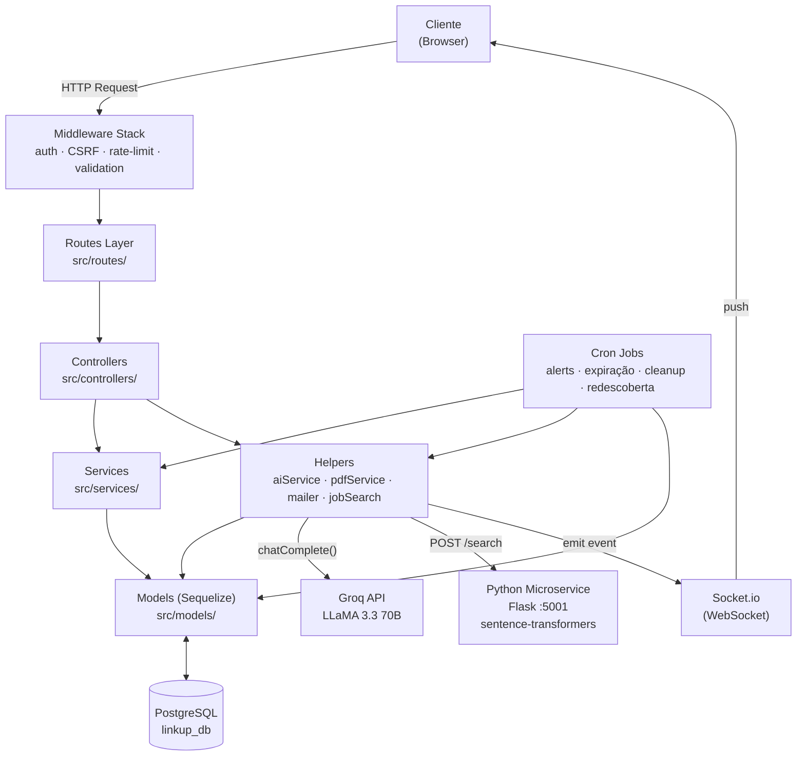

# Arquitetura do Sistema — LinkUp

**Versão:** 1.1
**Data:** 2026-03-29
**Autor:** Thiago Henrique Queiroz Muniz Silva

---

## Sumário

1. [Visão Geral](#1-visão-geral)
2. [Camadas da Aplicação](#2-camadas-da-aplicação)
3. [Diagrama de Fluxo Principal](#3-diagrama-de-fluxo-principal)
4. [Diagrama de Entidades](#4-diagrama-de-entidades)
5. [Fluxos Principais](#5-fluxos-principais)
6. [Integrações Externas](#6-integrações-externas)
7. [Decisões Arquiteturais (ADR)](#7-decisões-arquiteturais-adr)
8. [Segurança](#8-segurança)
9. [Escalabilidade e Limitações](#9-escalabilidade-e-limitações)
10. [Próximos Passos](#10-próximos-passos)

---

## 1. Visão Geral

O LinkUp segue uma **arquitetura em camadas (Layered Architecture)** com separação clara de responsabilidades entre rotas, controladores, serviços e helpers. A aplicação é uma **MPA (Multi-Page Application)** renderizada no servidor com Handlebars, complementada por comunicação em tempo real via Socket.io e um microserviço Python independente para busca semântica.

A escolha por MPA server-side rendering (SSR) foi deliberada: reduz a complexidade de estado no cliente, garante que os templates de IA (que geram HTML rico) sejam renderizados com segurança no servidor, e simplifica a proteção CSRF.

**Componentes do sistema:**

| Componente      | Tecnologia                           | Responsabilidade                           |
| --------------- | ------------------------------------ | ------------------------------------------ |
| Servidor Web    | Node.js + Express                    | Roteamento, middleware, SSR                |
| Banco de Dados  | PostgreSQL 16 + Sequelize 6          | Persistência e relacionamentos             |
| IA Principal    | Groq API (LLaMA 3.3 70B)             | Todas as features de linguagem natural     |
| Busca Semântica | Python Flask + sentence-transformers | Embeddings e similaridade semântica        |
| Tempo Real      | Socket.io 4                          | Notificações push sem polling              |
| Jobs Agendados  | node-cron 4                          | Alertas, expiração, cleanup, redescoberta  |
| E-mail          | Nodemailer + Gmail SMTP              | Verificação, recuperação de senha, alertas |

---

## 2. Camadas da Aplicação

```
src/
├── routes/          CAMADA 1 — Entrada: define endpoints, aplica middleware
├── middleware/       Transversal: auth, CSRF, rate limit, validação, audit
├── controllers/     CAMADA 2 — Orquestração: recebe req, chama services/helpers, responde
├── services/        CAMADA 3 — Lógica de negócio: regras, fluxos complexos, transações
├── helpers/         CAMADA 3 — Integrações: IA, PDF, e-mail, busca, socket
├── models/          CAMADA 4 — Dados: entidades Sequelize, relacionamentos, queries
└── jobs/            Lateral: cron jobs que executam fora do ciclo req/res
```

### 2.1 Rotas (`src/routes/`)

Ponto de entrada HTTP. Responsabilidade exclusiva: declarar endpoints, aplicar middleware corretos (autenticação, rate limiting, validação de input) e encaminhar para o controller. Nenhuma lógica de negócio reside aqui.

```
routes/
├── index.js          Monta todos os roteadores; aplica aiLimiter nas rotas de IA
├── auth.js           /login, /register, /verify, /forgot-password, /reset-password
├── home.js           /, /landing, /help
├── jobs.js           CRUD de vagas, candidaturas, favoritos, pipeline
├── chat.js           /:id/chat (IA contextual por vaga)
├── profile.js        Perfil, dashboard, avatar, página pública de empresa
├── resume.js         Criação, upload PDF, melhoria por IA, tailoring
├── interview.js      Simulação de entrevista por vaga
├── biasAudit.js      Auditoria de viés em descrições de vaga
├── tailoring.js      Adaptação de currículo para vaga específica
├── savedSearches.js  Buscas salvas com alertas automáticos
├── notifications.js  Listagem e marcação de notificações
└── aiMetrics.js      Dashboard de uso de features de IA
```

### 2.2 Middleware (`src/middleware/`)

Camada transversal que intercepta requisições antes dos controllers.

| Arquivo              | Função                                                                                                     |
| -------------------- | ---------------------------------------------------------------------------------------------------------- |
| `auth.js`            | `ensureAuthenticated`, `ensureCompany`, `ensureGuest`                                                      |
| `Ratelimiter.js`     | Rate limiters por contexto: `loginLimiter`, `aiLimiter`, `uploadLimiter`, `contactLimiter`, `resetLimiter` |
| `Validation.js`      | `validateLogin`, `validateRegister`, `validateJob`, `validateProfile`, `sanitizeInputs` (global)           |
| `validateCompany.js` | Verifica elegibilidade do domínio de e-mail ao registrar empresa                                           |
| `auditLog.js`        | Registra ações sensíveis em log estruturado                                                                |
| `globalLocals.js`    | Injeta `csrfToken`, `user`, `flashMessages` em todos os templates                                          |

### 2.3 Controllers (`src/controllers/`)

Thin controllers: recebem `req`/`res`, delegam lógica para services/helpers, retornam render ou redirect. Não contêm queries diretas ao banco nem lógica de negócio complexa.

| Controller                | Domínio                                                        |
| ------------------------- | -------------------------------------------------------------- |
| `authController`          | Autenticação, verificação de e-mail, onboarding, checklist     |
| `jobsController`          | CRUD vagas, candidaturas, pipeline, ranqueamento, redescoberta |
| `profileController`       | Perfil, dashboard de métricas, avatar, página pública          |
| `resumeController`        | Criação/edição de currículo, parsing PDF, melhoria por IA      |
| `chatController`          | Chat contextual IA por vaga                                    |
| `interviewController`     | Simulação de entrevista (início, resposta, avaliação)          |
| `tailoringController`     | Adaptação de currículo para vaga específica                    |
| `biasAuditController`     | Auditoria de viés em texto de vaga                             |
| `homeController`          | Homepage, landing, página de ajuda                             |
| `savedSearchesController` | Buscas salvas, toggle de alertas                               |

### 2.4 Services (`src/services/`)

Encapsulam lógica de negócio reutilizável e fluxos com múltiplas operações. São testáveis de forma isolada.

| Service                    | Responsabilidade                                                                                                                                |
| -------------------------- | ----------------------------------------------------------------------------------------------------------------------------------------------- |
| `applicationService`       | Criação de candidatura (validação de currículo, geração de carta por IA, score de compatibilidade), atualização de status                       |
| `talentRediscoveryService` | Identifica candidatos de processos anteriores compatíveis com vagas abertas atuais                                                              |
| `similarCandidatesService` | Recomenda candidatos similares ao melhor perfil de uma vaga                                                                                     |
| `searchService`            | Busca híbrida: semântica (sentence-transformers) + BM25 combinados via Reciprocal Rank Fusion no microserviço Python; fallback para SQL `ILIKE` |
| `availabilityService`      | Gerencia status de disponibilidade de candidatos e oportunidades revisitadas                                                                    |
| `onboardingService`        | Lógica do checklist de onboarding (progresso, dismiss, completion)                                                                              |
| `responsividadeService`    | Métricas de tempo de resposta da empresa no pipeline                                                                                            |

### 2.5 Helpers (`src/helpers/`)

Integrações com sistemas externos e utilitários de infraestrutura.

| Helper                  | Responsabilidade                                                                                                        |
| ----------------------- | ----------------------------------------------------------------------------------------------------------------------- |
| `aiService.js`          | Wrapper do Groq SDK com retry exponencial; único ponto de chamada ao LLM                                                |
| `groq.js`               | Instância configurada do `Groq` client (singleton)                                                                      |
| `jobSearch.js`          | `semanticSearch` (chama Python :5001 com título, descrição, requisitos, benefícios e diferenciais) + `getSuggestedJobs` |
| `pdfService.js`         | Centraliza geração de PDF via `html-pdf-node`                                                                           |
| `pdfUtils.js`           | Utilitários de formatação HTML para PDF (`escHtml` para XSS prevention)                                                 |
| `mailer.js`             | Transporter Nodemailer único; funções de envio por tipo de e-mail                                                       |
| `parseResume.js`        | Extração de texto de PDF e detecção de habilidades (ATS badges)                                                         |
| `aiLog.js`              | Persiste uso de IA na tabela `AiLogs` (feature, tokens, modelo)                                                         |
| `socket.js`             | Emissão de eventos Socket.io para notificações em tempo real                                                            |
| `logger.js`             | Logger estruturado (contexto, nível, stack trace)                                                                       |
| `handlebars-helpers.js` | Helpers customizados de template (formatação, condicionais)                                                             |

### 2.6 Models (`src/models/`)

Entidades Sequelize com relacionamentos declarados em `index.js`.

| Modelo         | Tabela           | Descrição                                                                         |
| -------------- | ---------------- | --------------------------------------------------------------------------------- |
| `User`         | `users`          | Candidatos e empresas (discriminado por `userType: 'candidato'/'empresa'`)                              |
| `Job`          | `jobs`           | Vagas com pipeline de etapas (JSON), tipo de contrato, status, flag PCD (`isPcd`) |
| `Application`  | `applications`   | Candidaturas com status, etapa atual, respostas                                   |
| `Resume`       | `resumes`        | Currículo estruturado do candidato                                                |
| `Notification` | `notifications`  | Notificações persistidas com flag `read`                                          |
| `Favorite`     | `favorites`      | Vagas favoritadas por candidatos                                                  |
| `JobView`      | `job_views`      | Visualizações de vagas (analytics; limpas após 90 dias via cron)                  |
| `AiLog`        | `ai_logs`        | Log de uso das features de IA                                                     |
| `SavedSearch`  | `saved_searches` | Buscas salvas com parâmetros e flag de alerta                                     |
| `UserBlock`    | `user_blocks`    | Bloqueio de empresa por candidato                                                 |

---

## 3. Diagrama de Fluxo Principal



---

## 4. Diagrama de Entidades

```mermaid
erDiagram
    User {
        int id PK
        string name
        string email
        string password
        string userType
        boolean isVerified
        string verificationCode
        string avatar
        string bio
        boolean openToWork
        string availabilityStatus
        boolean onboardingComplete
        boolean checklistDismissed
        datetime createdAt
    }
    Job {
        int id PK
        int UserId FK
        string title
        string description
        string company
        string email
        string city
        string modality
        string contractType
        string salary
        text requirements
        text benefits
        text differential
        text stages
        text questions
        string status
        int views
        boolean isPcd
        datetime createdAt
    }
    Application {
        int id PK
        int userId FK
        int jobId FK
        string status
        string currentStage
        text answers
        int answersScore
        text answersFeedback
        text stageHistory
        boolean reminderSent
        datetime createdAt
    }
    Resume {
        int id PK
        int userId FK
        text summary
        text experiences
        text education
        text skills
        string phone
        string city
        string birthDate
        string address
        string linkedin
        string github
        datetime createdAt
    }
    Notification {
        int id PK
        int userId FK
        string type
        string message
        boolean read
        datetime createdAt
    }
    AiLog {
        int id PK
        int userId FK
        string feature
        string model
        int tokensUsed
        datetime createdAt
    }
    SavedSearch {
        int id PK
        int userId FK
        string query
        json filters
        boolean alertEnabled
        datetime createdAt
    }
    Favorite { int id PK; int userId FK; int jobId FK }
    JobView { int id PK; int userId FK; int jobId FK; datetime viewedAt }
    UserBlock { int id PK; int userId FK; int companyId FK }

    User ||--o{ Job : "publica"
    User ||--o{ Application : "candidata"
    User ||--o{ Resume : "possui"
    User ||--o{ Notification : "recebe"
    User ||--o{ AiLog : "gera"
    User ||--o{ SavedSearch : "salva"
    User ||--o{ Favorite : "favorita"
    User ||--o{ JobView : "visualiza"
    User ||--o{ UserBlock : "bloqueia"
    Job  ||--o{ Application : "recebe"
    Job  ||--o{ Favorite : "é favorita"
    Job  ||--o{ JobView : "é visualizada"
```

---

## 5. Fluxos Principais

### 5.1 Candidatura com IA

```
Candidato → POST /jobs/apply/:id
  ├── applicationService.applyToJob()
  │   ├── Verifica se possui currículo (RN-501)
  │   ├── Verifica candidatura duplicada (RN-502)
  │   ├── aiService.chatComplete() → Gera carta de apresentação
  │   ├── aiService.chatComplete() → Calcula score de compatibilidade
  │   ├── Application.create()
  │   └── socket.emit('notification') → Empresa notificada em tempo real
  └── Redireciona para /jobs/my-applications
```

### 5.2 Busca Semântica Híbrida

```
Usuário → GET / (query params: job, modality, city, salary, skill, page)
  ├── searchService.searchJobs()
  │   ├── Carrega vagas abertas do PostgreSQL (até 200, aplicando filtros de modalidade/cidade)
  │   └── fetch('http://localhost:5001/search', { query, jobs: [{id, title, description, ...}] })
  │       └── Python: sentence-transformers (semântico) + BM25Okapi (keywords)
  │                   → Reciprocal Rank Fusion → ranking final por relevância
  │   └── Fallback (Python offline): PostgreSQL ILIKE em title/company
  └── Renderiza home com resultados paginados ordenados por relevância
```

### 5.3 Pipeline de Etapas

```
Empresa → Cria vaga com estágios customizados ou sugere via IA
  ├── POST /jobs/add → stages salvo como JSON na coluna jobs.stages
  └── Por candidatura:
      POST /jobs/applications/stage
        ├── jobsController.updateStage()
        ├── applicationService.updateApplicationStatus()
        ├── Notification.create() para candidato
        └── socket.emit('notification')
```

### 5.4 Redescoberta de Talentos (Cron)

```
node-cron → talentRediscoveryJob (agendado diariamente)
  └── talentRediscoveryService.run()
      ├── Busca vagas abertas sem candidatos suficientes
      ├── Busca candidatos de processos anteriores (Applications encerradas)
      ├── aiService.chatComplete() → Analisa compatibilidade residual
      ├── Filtra candidatos com score ≥ threshold
      └── Notification.create() → "Seu perfil foi redescoberto para [Vaga]"
```

### 5.5 Simulação de Entrevista

```
POST /interview/:jobId/start
  └── interviewController.start()
      └── aiService.chatComplete() → Gera 5 perguntas baseadas na vaga
          → Retorna JSON { questions: [...] }

POST /interview/:jobId/answer
  └── Salva resposta do candidato na sessão

POST /interview/:jobId/score
  └── interviewController.score()
      └── aiService.chatComplete() → Avalia respostas + gera feedback por pergunta
          → Retorna { score, feedback, suggestions }
```

---

## 6. Integrações Externas

### 6.1 Groq API (LLaMA 3.3 70B)

Todas as chamadas à IA passam exclusivamente pelo `src/helpers/aiService.js`, que implementa:

- **Retry exponencial**: até 3 tentativas com backoff em caso de erro 429 ou timeout
- **Cache de resposta**: `src/utils/aiCache.js` evita chamadas redundantes para prompts idênticos
- **Log automático**: toda chamada registra feature, tokens e modelo em `AiLogs` via `aiLog.js`
- **Prompt estruturado**: instruções de sistema separadas do conteúdo do usuário em cada feature

Features que utilizam a IA:

| Feature                  | Endpoint                   | Prompt Objetivo                               |
| ------------------------ | -------------------------- | --------------------------------------------- |
| Carta de apresentação    | POST /jobs/apply/:id       | Gerar carta personalizada currículo × vaga    |
| Score de compatibilidade | POST /jobs/apply/:id       | Pontuar fit técnico e cultural                |
| Melhoria de vaga         | POST /jobs/add (toggle)    | Reescrever descrição com clareza              |
| Ranking de candidatos    | GET /jobs/applications/:id | Ordenar por compatibilidade com justificativa |
| Chat contextual          | POST /jobs/:id/chat        | Responder perguntas sobre a vaga              |
| Simulação de entrevista  | POST /interview/:jobId/\*  | Gerar e avaliar perguntas                     |
| Tailoring de currículo   | POST /tailoring/:jobId     | Sugerir adaptações do currículo               |
| Bias Auditor             | POST /bias/audit           | Detectar linguagem excludente                 |
| Melhoria de currículo    | POST /resume/ai/improve    | Reescrever currículo profissionalmente        |
| Sugestão de etapas       | POST /jobs/add             | Sugerir pipeline baseado na área              |
| Redescoberta de talentos | Cron diário                | Avaliar compatibilidade residual              |
| Encerramento de vaga     | POST /jobs/close/:id       | Gerar feedback humanizado por candidato       |

### 6.2 Python Microserviço — Busca Semântica

**Tecnologias:** Flask + `sentence-transformers` (modelo `paraphrase-multilingual-MiniLM-L12-v2`) + `rank-bm25`

**Endpoint exposto:** `POST http://localhost:5001/search`

**Payload:**

```json
{
  "query": "desenvolvedor backend Node.js remoto",
  "jobs": [
    {
      "id": 1,
      "title": "Desenvolvedor Backend",
      "description": "...",
      "requirements": "...",
      "benefits": "...",
      "differential": "...",
      "company": "Empresa X",
      "modality": "homeoffice",
      "city": "São Paulo"
    }
  ],
  "limit": 50
}
```

**Resposta:**

```json
{
  "ids": [3, 7, 1, 12],
  "scores": { "3": 0.87, "7": 0.74, "1": 0.61, "12": 0.55 },
  "total": 4
}
```

O Node.js chama o microserviço via `fetch` nativo (Node.js 18+) com timeout de 4 segundos. Em caso de falha (timeout, serviço offline), o sistema faz fallback para a busca textual ILIKE do PostgreSQL, garantindo disponibilidade.

### 6.3 Socket.io — Notificações em Tempo Real

O servidor Socket.io é inicializado em `server.js` e compartilhado com `src/config/socket.js`. O `userId` do socket é extraído exclusivamente da sessão Express (nunca do cliente), prevenindo falsificação de identidade.

Eventos emitidos:

- `notification` — nova notificação (candidatura recebida, status atualizado, vaga encerrada)
- `stage-update` — mudança de etapa no pipeline

### 6.4 Cron Jobs

| Job                     | Agendamento    | Responsabilidade                                                      |
| ----------------------- | -------------- | --------------------------------------------------------------------- |
| `alertsJob`             | Diário (manhã) | Verifica buscas salvas com alerta ativo; envia e-mail com novas vagas |
| `applicationsExpiryJob` | Diário         | Marca candidaturas sem resposta como expiradas após N dias            |
| `talentRediscoveryJob`  | Diário         | Identifica e notifica talentos redescobertos                          |
| `jobViewCleanupJob`     | Domingo às 04h | Remove registros `JobView` com mais de 90 dias                        |

---

## 7. Decisões Arquiteturais (ADR)

### ADR-001 — Pipeline de Etapas como JSON na coluna `stages`

**Decisão:** O pipeline de etapas do processo seletivo é armazenado como `JSON` na coluna `stages` do modelo `Job`, e não em uma tabela separada.

**Justificativa:** As etapas são específicas de cada vaga e raramente precisam de queries independentes. Uma tabela normalizada (`JobStages`) adicionaria joins desnecessários para cada carregamento de vaga. A flexibilidade de adicionar campos customizados por etapa (nome, descrição, cor) sem migrations adicionais foi determinante.

**Impacto:** Leituras de pipeline são O(1) (sem join). Edição de etapas é simples. O campo `stages` é `TEXT` (JSON serializado), não `JSONB` nativo — operadores `->` e `->>` do PostgreSQL não se aplicam. A serialização/deserialização é feita no código Node.js com `JSON.parse` / `JSON.stringify`. Limitação: queries analíticas por etapa requerem extração via `json_array_elements` ou processamento em memória.

---

### ADR-002 — Separação de Services e Helpers

**Decisão:** Lógica de negócio reside em `services/`; integrações externas e utilitários em `helpers/`.

**Justificativa:** Controllers thin que chamam services e helpers diretamente tornam o código testável e compreensível. Services encapsulam fluxos complexos com múltiplas operações (ex: criar candidatura = validar + IA + persistir + notificar). Helpers encapsulam dependências externas (Groq, Nodemailer, html-pdf-node) que podem ser substituídas sem afetar a lógica de negócio.

**Impacto:** Facilita substituição do provider de IA (ex: trocar Groq por OpenAI) alterando apenas `aiService.js`. Facilita testes unitários de services com helpers mockados.

---

### ADR-003 — Groq (LLaMA 3.3 70B) como Provider de IA

**Decisão:** Uso do Groq API com modelo LLaMA 3.3 70B em vez de OpenAI GPT ou modelos locais.

**Justificativa:** O Groq oferece latência extremamente baixa (inferência em hardware GROQ LPU) e um tier gratuito generoso, viável para desenvolvimento e demonstração acadêmica. O LLaMA 3.3 70B tem desempenho comparável ao GPT-4o em tarefas de linguagem em português. Modelos locais (Ollama) foram descartados por limitação de hardware no ambiente de desenvolvimento.

**Impacto:** Dependência de serviço externo e conectividade. Mitigado com retry exponencial e cache de respostas.

---

### ADR-004 — Microserviço Python para Busca Semântica

**Decisão:** Busca semântica implementada como microserviço Flask independente, não embutida no Node.js.

**Justificativa:** O ecossistema Python (`sentence-transformers`, `torch`) é significativamente superior ao Node.js para embeddings de texto. Isolar em microserviço permite escalar, atualizar modelos e reiniciar o serviço de busca sem afetar o servidor principal. A comunicação via HTTP REST é simples e sem overhead de message queue para o volume atual.

**Impacto:** Requer processo Python adicional. Falha do microserviço não derruba o sistema principal (fallback para busca textual).

---

### ADR-005 — MPA com SSR em vez de SPA

**Decisão:** Aplicação renderizada no servidor com Handlebars em vez de framework SPA (React, Vue).

**Justificativa:** Simplifica proteção CSRF (token injetado em todos os forms no servidor), elimina complexidade de gerenciamento de estado no cliente, e garante que conteúdo gerado por IA (que pode conter markdown/HTML) seja sanitizado e renderizado com segurança. Socket.io cobre os casos de uso que precisam de reatividade.

**Impacto:** Navegação por full-page reload (exceto notificações em tempo real via Socket.io). Adequado para o escopo do projeto.

---

### ADR-006 — `csrf-csrf` em vez de `csurf`

**Decisão:** Migração de `csurf` para `csrf-csrf` para proteção CSRF.

**Justificativa:** O pacote `csurf` foi depreciado e possui vulnerabilidades conhecidas. O `csrf-csrf` implementa o padrão double-submit cookie de forma stateless, compatível com Express 4 e sessions, com 0 vulnerabilidades reportadas no `npm audit`.

**Impacto:** CSRF token disponível em `res.locals.csrfToken` para todos os templates via middleware `globalLocals`.

---

## 8. Segurança

| Mecanismo        | Implementação                                                             | Cobertura                                   |
| ---------------- | ------------------------------------------------------------------------- | ------------------------------------------- |
| Autenticação     | Passport.js LocalStrategy + bcryptjs (salt 10)                            | Todas as rotas protegidas                   |
| CSRF             | `csrf-csrf` double-submit cookie                                          | Todos os formulários POST                   |
| Rate Limiting    | `express-rate-limit` por tipo de endpoint                                 | Login, registro, IA, upload, reset de senha |
| CSP              | `helmet` com diretivas restritivas                                        | Todas as respostas HTTP                     |
| Sanitização      | `sanitizeInputs` middleware global                                        | Todos os campos de entrada                  |
| XSS em PDF       | `escHtml()` em `pdfUtils.js`                                              | Geração de PDF com dados do usuário         |
| Upload           | Multer com fileFilter (MIME + extensão) + limite 3MB (avatar) / 5MB (PDF) | Upload de arquivos                          |
| Session Security | `httpOnly`, `sameSite: strict`, `secure` (produção)                       | Cookies de sessão                           |
| Enumeração       | Respostas genéricas em autenticação                                       | `/login`, `/forgot-password`                |
| Socket.io        | `userId` via sessão Express, não via cliente                              | Eventos de notificação                      |
| Headers          | `x-powered-by` desabilitado, HSTS em produção                             | Todas as respostas                          |

---

## 9. Escalabilidade e Limitações

### Pontos de escala horizontal

- **Microserviço Python**: pode ser escalado independentemente em múltiplas instâncias com load balancer
- **Cron jobs**: atualmente acoplados ao processo principal; em escala, migrar para um worker separado ou fila de mensagens (BullMQ, Redis)
- **Socket.io**: em múltiplas instâncias Node, requer Redis adapter para sincronização de salas

### Limitações atuais

| Limitação                  | Impacto                                         | Mitigação possível                                    |
| -------------------------- | ----------------------------------------------- | ----------------------------------------------------- |
| Groq API (external)        | Latência variável; tier gratuito tem rate limit | Cache de respostas em `aiCache.js`; retry exponencial |
| Socket.io single-instance  | Não escala horizontalmente sem adapter          | Socket.io Redis Adapter                               |
| Cron no processo principal | Falha do app para todos os jobs                 | Worker dedicado (BullMQ)                              |
| PDF gerado em memória      | Alto consumo de memória para relatórios grandes | Streaming ou geração assíncrona                       |
| Python microserviço local  | Requer processo adicional em produção           | Docker Compose ou processo gerenciado por PM2         |

---

## 10. Próximos Passos

- [ ] Containerização com Docker Compose (Node + Python + PostgreSQL)
- [ ] Testes automatizados: unitários (services) e integração (routes)
- [ ] API REST pública documentada com Swagger/OpenAPI (base já criada em `src/config/swagger.js`)
- [ ] Separação do worker de cron jobs em processo dedicado
- [ ] Socket.io Redis Adapter para suporte multi-instância
- [ ] CI/CD pipeline com GitHub Actions
- [ ] Métricas de observabilidade (Prometheus + Grafana ou similar)
